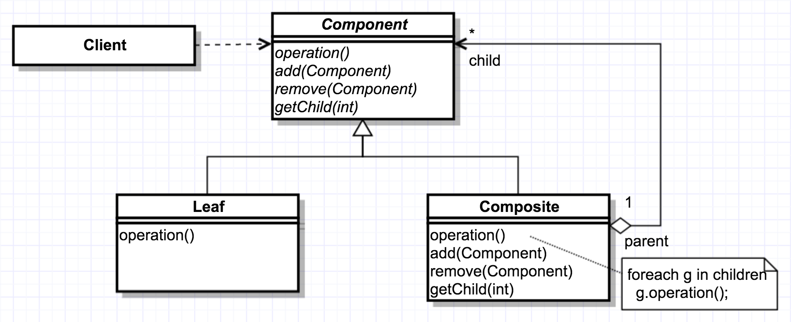

# Design Patterns

明明是 functional programming，還玩 design pattern，我一定是瘋了，哈哈

## Abstract Factory
參考資料：[Abstract factory pattern](https://en.wikipedia.org/wiki/Abstract_factory_pattern)

用同一個介面來建立一整族相關或相依的物件，不需點名個物件真正所屬的具象類別。


```scala
// Abstract Product
trait Button
trait Border

// Concrete Product
class MacButton extends Button { override def toString = "MacButton" }
class MacBorder extends Border { override def toString = "MacBorder" }

class WinButton extends Button { override def toString = "WinButton" }
class WinBorder extends Border { override def toString = "WinBorder" }

// Abstract Factory
trait Factory {
  def createButton: Button
  def createBorder: Border
}

// Concrete Factory
class MacFactory extends Factory {
  def createButton = new MacButton
  def createBorder = new MacBorder
}

class WinFactory extends Factory {
  def createButton = new WinButton
  def createBorder = new WinBorder
}

// Client
class Client(factory: Factory) {
  def test = {
    val button = factory.createButton
    val border = factory.createBorder
    println(s"create $button and $border")
  }
}

// Test driver
val c1 = new Client(new MacFactory)
c1.test // create MacButton and MacBorder

val c2 = new Client(new WinFactory)
c2.test // create WinButton and WinBorder
```

## Builder 
參考資料：[Builder pattern](https://en.wikipedia.org/wiki/Builder_pattern)

從複雜物件的佈局中抽取出生成程序，以便用同一個生成程序製造特種不同的物件佈局。


```scala
// Product
class Car {
  var wheels: Int = _
  var color: String = _

  override def toString = s"Car [wheels=${wheels}, color=${color}]"
  def setWheels(wheels: Int) { this.wheels = wheels }
  def setColor(color: String) { this.color = color }
}

// Abstract Builder
trait CarBuilder {
  def setWheels(wheels: Int)
  def setColor(color: String)
  def getResult: Car
}

// Concrete Builder
class CarBuilderImpl extends CarBuilder {
  val car = new Car
  def setWheels(wheels: Int) = car.setWheels(wheels)
  def setColor(color: String) = car.setColor(color)
  def getResult = car
}

// Director
class CarBuilderDirector(builder: CarBuilder) {
  def construct: Car = {
    builder.setWheels(4)
    builder.setColor("Red")
    builder.getResult
  }
}

// Test driver
val director = new CarBuilderDirector(new CarBuilderImpl)
val car = director.construct
println(car)  // Car [wheels=4, color=Red]
```

## Factory Method
參考資料：[Factory method pattern](https://en.wikipedia.org/wiki/Factory_method_pattern)

定義可資生成物件的介面，但讓子類別去決定該具現出哪一種類別的物件。此模式讓類別將具現化程序交付給子類別去處置。


```scala
// Abstract Product 
trait Product { abstract def fun: Unit }

// Concrete Product
class ConcreteProduct extends Product { def fun = println("I'm ConcreteProductProduct") }

// Abstract Creator
trait Creator { def factoryMethod: Product }

// Concrete Creator
class ConcreteCreator extends Creator { def factoryMethod = new ConcreteProduct }

// Test driver
val c = new ConcreteCreator
val p = c.factoryMethod
p.fun // I'm ConcreteProductProduct
```

## Prototype
参考资料：[Prototype pattern](https://en.wikipedia.org/wiki/Prototype_pattern)

制定可用原型個體生成的物件類型，爾後只須複製此原型即可生成新物件。


```scacl
// Prototype
trait Cloneable[A] { self: A =>
  def copy: A
}

// Concrete Prototype
class Box(val size: Int) extends Cloneable[Box] {
  def copy = new Box(size)
}

// Test driver
val b1 = new Box(3) // b1: Box = Box@d5af0a5
val b2 = b1.copy    // b2: Box = Box@79c5460e
```

An answer to [How to clone objects in Scala?](http://stackoverflow.com/questions/6417450/how-to-clone-objects-in-scala)
- If that complex object is mutable or contain mutable parts, then the solution is the same as in Java. Check Java questions & posts about it and do that.
- If everything is immutable, then you don't need and shouldn't clone anything. At best, you should make a shallow copy of the object, changing only the fields that need changing, and, at worst, you use something like lenses or zippers to copy some deep object and propagate the change upwards. See questions on Scala about lenses and zippers for that.

## Singleton
參考資料：[Singleton pattern](https://en.wikipedia.org/wiki/Singleton_pattern)

確保類別只會有一個物件實體存在，並提供單一存取窗口。


```scala
object Singleton
```

## Adapter
參考資料：[Adapter pattern](https://en.wikipedia.org/wiki/Adapter_pattern)


```scala
// Adaptee
class LegacyLine {
  def draw(x1: Int, y1: Int, x2: Int, y2: Int) = println(s"line from ($x1, $y1) to ($x2, $y2)")
}

class LegacyRectangle {
  def draw(x: Int, y: Int, w: Int, h: Int) = println(s"rectangle at ($x, $y) with width $w and height $h")
}

// Adapter
trait Shape { def draw(x1: Int, y1: Int, x2: Int, y2: Int) }

class Line extends Shape {
  val adaptee: LegacyLine = new LegacyLine
  def draw(x1: Int, y1: Int, x2: Int, y2: Int) = adaptee.draw(x1, y1, x2, y2)
}

class Rectangle extends Shape {
  val adaptee: LegacyRectangle = new LegacyRectangle
  def draw(x1: Int, y1: Int, x2: Int, y2: Int) = adaptee.draw(Math.min(x1, x2), Math.min(y1, y2), Math.abs(x1 - x2), Math.abs(y1 - y2))
}

// Test driver
val line = new Line
val rectangle = new Rectangle

line.draw(10, 20, 30, 60)       //line from (10, 20) to (30, 60)
rectangle.draw(10, 20, 30, 60)  //rectangle at (10, 20) with width 20 and height 40
```

## Bridge
參考資料：[Bridge pattern](https://en.wikipedia.org/wiki/Bridge_pattern)

將實作體系與抽象體系分離開來，讓兩者能各自更動各自演進。


```scala
// Implementor
trait DrawingAPI {
  def drawCircle(x: Double, y: Double, radius: Double)
}

// Concrete Implementor
class DrawingAPI1 extends DrawingAPI {
  def drawCircle(x: Double, y: Double, radius: Double) = println(s"Circle1 at ($x, $y), adius: $radius")
}

class DrawingAPI2 extends DrawingAPI {
  def drawCircle(x: Double, y: Double, radius: Double) = println(s"Circle2 at ($x, $y), adius: $radius")
}

// Abstraction
abstract class Shape(drawingAPI: DrawingAPI) {
  def draw()
  def resizePercentage(pct: Double)
}

// Refined Abstraction
class CircleShape(x: Double, y: Double, var radius: Double, drawingAPI: DrawingAPI) extends Shape(drawingAPI) {
  def draw = drawingAPI.drawCircle(x, y, radius)
  def resizePercentage(pct: Double) { radius *= pct }
}

// Client
Seq (new CircleShape(1,3,7, new DrawingAPI1),
     new CircleShape(5,7,11, new DrawingAPI2)
) foreach { c =>
  c.resizePercentage(2.5)
  c.draw
}
// Circle1 at (1.0, 3.0), adius: 17.5
// Circle2 at (5.0, 7.0), adius: 27.5
```

## Composite
參考資料：[Composite pattern](https://en.wikipedia.org/wiki/Composite_pattern)

將物件組織成樹狀結構，「部分-全體」階層關係，讓外界以一致性的方式對待個別物件與整體物件。




```scala
// Component
abstract class Inode(name: String) {
  def ls(indent: Int = 0): Unit
}

// Leaf
class File(name: String) extends Inode(name) {
  def ls(indent: Int) = println("  "*indent + name)
}

// Composite
import scala.collection.JavaConversions._
class Directory(name: String) extends Inode(name) {
  val inodes = new java.util.ArrayList[Inode]()
  def add(inode: Inode) = inodes.add(inode)
  def ls(indent: Int) = {
    println("  "*indent + name)
    inodes.foreach{inode => inode.ls(indent+1)}
  }
}

// Client
val d1 = new Directory("dir1")
val d2 = new Directory("dir2") 
val d3 = new Directory("dir3") 
val f1 = new File("file1")
val f2 = new File("file2")
val f3 = new File("file3")

d1.add(f1)
d1.add(d2)
d2.add(f2)
d2.add(d3)
d3.add(f3)

d1.ls()
// dir1
//   file1
//   dir2
//     file2
//     dir3
//       file3
```
