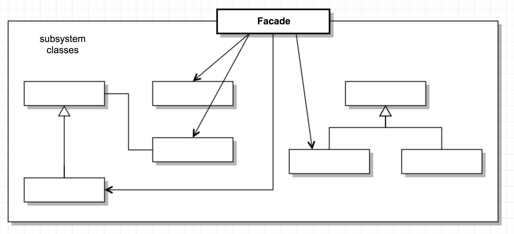

# Design Patterns

明明是 functional programming，還玩 design pattern，我一定是瘋了，哈哈

## Abstract Factory
用同一個介面來建立一整族相關或相依的物件，不需點名個物件真正所屬的具象類別。


```scala
// Abstract Product
trait Button
trait Border

// Concrete Product
class MacButton extends Button { override def toString = "MacButton" }
class MacBorder extends Border { override def toString = "MacBorder" }

class WinButton extends Button { override def toString = "WinButton" }
class WinBorder extends Border { override def toString = "WinBorder" }

// Abstract Factory
trait Factory {
  def createButton: Button
  def createBorder: Border
}

// Concrete Factory
class MacFactory extends Factory {
  def createButton = new MacButton
  def createBorder = new MacBorder
}

class WinFactory extends Factory {
  def createButton = new WinButton
  def createBorder = new WinBorder
}

// Client
class Client(factory: Factory) {
  def test = {
    val button = factory.createButton
    val border = factory.createBorder
    println(s"create $button and $border")
  }
}

// Test driver
val c1 = new Client(new MacFactory)
c1.test // create MacButton and MacBorder

val c2 = new Client(new WinFactory)
c2.test // create WinButton and WinBorder
```

## Builder 
從複雜物件的佈局中抽取出生成程序，以便用同一個生成程序製造特種不同的物件佈局。


```scala
// Product
class Car {
  var wheels: Int = _
  var color: String = _

  override def toString = s"Car [wheels=${wheels}, color=${color}]"
  def setWheels(wheels: Int) { this.wheels = wheels }
  def setColor(color: String) { this.color = color }
}

// Abstract Builder
trait CarBuilder {
  def setWheels(wheels: Int)
  def setColor(color: String)
  def getResult: Car
}

// Concrete Builder
class CarBuilderImpl extends CarBuilder {
  val car = new Car
  def setWheels(wheels: Int) = car.setWheels(wheels)
  def setColor(color: String) = car.setColor(color)
  def getResult = car
}

// Director
class CarBuilderDirector(builder: CarBuilder) {
  def construct: Car = {
    builder.setWheels(4)
    builder.setColor("Red")
    builder.getResult
  }
}

// Test driver
val director = new CarBuilderDirector(new CarBuilderImpl)
val car = director.construct
println(car)  // Car [wheels=4, color=Red]
```

## Factory Method
定義可資生成物件的介面，但讓子類別去決定該具現出哪一種類別的物件。此模式讓類別將具現化程序交付給子類別去處置。


```scala
// Abstract Product 
trait Product { abstract def fun: Unit }

// Concrete Product
class ConcreteProduct extends Product { def fun = println("I'm ConcreteProductProduct") }

// Abstract Creator
trait Creator { def factoryMethod: Product }

// Concrete Creator
class ConcreteCreator extends Creator { def factoryMethod = new ConcreteProduct }

// Test driver
val c = new ConcreteCreator
val p = c.factoryMethod
p.fun // I'm ConcreteProductProduct
```

## Prototype
制定可用原型個體生成的物件類型，爾後只須複製此原型即可生成新物件。


```scacl
// Prototype
trait Cloneable[A] { self: A =>
  def copy: A
}

// Concrete Prototype
class Box(val size: Int) extends Cloneable[Box] {
  def copy = new Box(size)
}

// Test driver
val b1 = new Box(3) // b1: Box = Box@d5af0a5
val b2 = b1.copy    // b2: Box = Box@79c5460e
```

An answer to [How to clone objects in Scala?](http://stackoverflow.com/questions/6417450/how-to-clone-objects-in-scala)
- If that complex object is mutable or contain mutable parts, then the solution is the same as in Java. Check Java questions & posts about it and do that.
- If everything is immutable, then you don't need and shouldn't clone anything. At best, you should make a shallow copy of the object, changing only the fields that need changing, and, at worst, you use something like lenses or zippers to copy some deep object and propagate the change upwards. See questions on Scala about lenses and zippers for that.

## Singleton
確保類別只會有一個物件實體存在，並提供單一存取窗口。


```scala
object Singleton
```

## Adapter
將類別的介面轉換成外界所預期的另一種介面，讓原先囿於介面不相容問題而無法協力合作的類別能夠兜在一起用。


```scala
// Adaptee
class LegacyLine {
  def draw(x1: Int, y1: Int, x2: Int, y2: Int) = println(s"line from ($x1, $y1) to ($x2, $y2)")
}

class LegacyRectangle {
  def draw(x: Int, y: Int, w: Int, h: Int) = println(s"rectangle at ($x, $y) with width $w and height $h")
}

// Adapter
trait Shape { def draw(x1: Int, y1: Int, x2: Int, y2: Int) }

class Line extends Shape {
  val adaptee: LegacyLine = new LegacyLine
  def draw(x1: Int, y1: Int, x2: Int, y2: Int) = adaptee.draw(x1, y1, x2, y2)
}

class Rectangle extends Shape {
  val adaptee: LegacyRectangle = new LegacyRectangle
  def draw(x1: Int, y1: Int, x2: Int, y2: Int) = adaptee.draw(Math.min(x1, x2), Math.min(y1, y2), Math.abs(x1 - x2), Math.abs(y1 - y2))
}

// Test driver
val line = new Line
val rectangle = new Rectangle

line.draw(10, 20, 30, 60)       //line from (10, 20) to (30, 60)
rectangle.draw(10, 20, 30, 60)  //rectangle at (10, 20) with width 20 and height 40
```

## Bridge
將實作體系與抽象體系分離開來，讓兩者能各自更動各自演進。


```scala
// Implementor
trait DrawingAPI {
  def drawCircle(x: Double, y: Double, radius: Double)
}

// Concrete Implementor
class DrawingAPI1 extends DrawingAPI {
  def drawCircle(x: Double, y: Double, radius: Double) = println(s"Circle1 at ($x, $y), adius: $radius")
}

class DrawingAPI2 extends DrawingAPI {
  def drawCircle(x: Double, y: Double, radius: Double) = println(s"Circle2 at ($x, $y), adius: $radius")
}

// Abstraction
abstract class Shape(drawingAPI: DrawingAPI) {
  def draw()
  def resizePercentage(pct: Double)
}

// Refined Abstraction
class CircleShape(x: Double, y: Double, var radius: Double, drawingAPI: DrawingAPI) extends Shape(drawingAPI) {
  def draw = drawingAPI.drawCircle(x, y, radius)
  def resizePercentage(pct: Double) { radius *= pct }
}

// Client
Seq (new CircleShape(1,3,7, new DrawingAPI1),
     new CircleShape(5,7,11, new DrawingAPI2)
) foreach { c =>
  c.resizePercentage(2.5)
  c.draw
}
// Circle1 at (1.0, 3.0), adius: 17.5
// Circle2 at (5.0, 7.0), adius: 27.5
```

## Composite
將物件組織成樹狀結構，「部分-全體」階層關係，讓外界以一致性的方式對待個別物件與整體物件。


```scala
// Component
abstract class Inode(name: String) {
  def ls(indent: Int = 0): Unit
}

// Leaf
class File(name: String) extends Inode(name) {
  def ls(indent: Int) = println("  "*indent + name)
}

// Composite
import scala.collection.JavaConversions._
class Directory(name: String) extends Inode(name) {
  val inodes = new java.util.ArrayList[Inode]()
  def add(inode: Inode) = inodes.add(inode)
  def ls(indent: Int) = {
    println("  "*indent + name)
    inodes.foreach{inode => inode.ls(indent+1)}
  }
}

// Client
val d1 = new Directory("dir1")
val d2 = new Directory("dir2") 
val d3 = new Directory("dir3") 
val f1 = new File("file1")
val f2 = new File("file2")
val f3 = new File("file3")

d1.add(f1)
d1.add(d2)
d2.add(f2)
d2.add(d3)
d3.add(f3)

d1.ls()
// dir1
//   file1
//   dir2
//     file2
//     dir3
//       file3
```

## Decorator
將額外權責動態附加於物件身上，不必衍生子類別即可彈性擴增功能。


```scala
// Component
trait Component {
  def doIt: Unit
}

// Concrete Component
class ConcreteComponent extends Component {
  def doIt = System.out.print('A')
}

// Decorator
abstract class Decorator(component: Component) extends Component {
  private val core = component
  def doIt = core.doIt
}

// Concrete Decorator
class ConcreteDecoratorX(component: Component) extends Decorator(component) {
  private def doX = System.out.print('X')
  override def doIt = {
    super.doIt
    doX
  }
}

class ConcreteDecoratorY(component: Component) extends Decorator(component) {
  private def doY = System.out.print('Y')
  override def doIt = {
    super.doIt
    doY
  }
}

class ConcreteDecoratorZ(component: Component) extends Decorator(component) {
  private def doZ = System.out.print('Z')
  override def doIt = {
    super.doIt
    doZ
  }
}

// Test driver
val list = List(
  new ConcreteDecoratorX(new ConcreteComponent),
  new ConcreteDecoratorY(new ConcreteDecoratorX(new ConcreteComponent)),
  new ConcreteDecoratorZ(new ConcreteDecoratorY(new ConcreteDecoratorX(new ConcreteComponent))))

list.foreach{ item => item.doIt; println() }
```

## Facade
替子系統裡的一堆介面定義一套統一的高階介面，讓子系統更易使用。



```scala
// Subsystem
class CPU {
  def freeze() = println("CPU freezed")
  def jump(addr: Int) = println(f"jump to ${addr}%x")
  def execute() = println("CPU executing")
}

class Memory {
  def load(addr: Int, data: Array[Byte]) = println(f"load ${data.mkString("(", ", ", ")")} to ${addr}%x")
}

class HardDrive {
  def read(addr: Int, size: Int): Array[Byte] = Array(1,2,3,4)
}

// Facade
class Computer {
  private val processor = new CPU()
  private val ram = new Memory()
  private val hd = new HardDrive()

  def start() = {
    processor.freeze()
    ram.load(0x80010000, hd.read(0x00000000, 512))
    processor.jump(0x80010000)
    processor.execute()
  }
}

// Test driver
val computer = new Computer()
computer.start()
```

## Flyweight
以共享機制有效地支援一大堆小規模的物件。


```scala
// Flyweight
trait Glyph {
  def draw(): Unit
}

// Concrete Flyweight
class Character(c: Char) {
  def draw() = System.out.print(c)
}

// Unshared Concrete Flyweight
class Row {
  val chars = scala.collection.mutable.ListBuffer[Character]()
  def addChar(char: Character) = { chars += char }
  def draw() = { chars.foreach(_.draw()) }
}

// Flyweight Factory
class CharacterFactory {
  val chars = scala.collection.mutable.LinkedHashMap[Char, Character]()
  def getCharacter(c: Char) = chars.getOrElseUpdate(c, new Character(c))
  def numChars = chars.size
}

// Client
val factory = new CharacterFactory()
val row = new Row()

row.addChar(factory.getCharacter('b'))
row.addChar(factory.getCharacter('a'))
row.addChar(factory.getCharacter('n'))
row.addChar(factory.getCharacter('a'))
row.addChar(factory.getCharacter('n'))
row.addChar(factory.getCharacter('a'))

row.draw()        //> banana
factory.numChars  //> 3
```

## Proxy
替其他物件預留代理空位，藉此控制存取其他物件。


```scala
// Subject
trait Image {
  def displayImage(): Unit
}

// Real Subject
class RealImage(filename: String) extends Image {
  def displayImage() = println(s"Displaying $filename")
  private def loadImageFromDisk() = println(s"Loading $filename")
  loadImageFromDisk()
}

// Proxy
class ProxyImage(filename: String) extends Image {
  var image: RealImage = null
  def displayImage() = {
    if (image == null) {
      image = new RealImage(filename)
    }
    image.displayImage()
  }
}

// Test driver
val image = new ProxyImage("apple.jpg")

image.displayImage()  //> Loading banana.jpg
                      //> Displaying banana.jpg
image.displayImage()  //> Displaying banana.jpg
```

## Chain of Responsibility
讓多個物件都有機會處理某一訊息，以降低訊息發送者和接收者之間的耦合關係。它將接收者串連起來，讓訊息流經其中，直到被處理了為止。


```scala
// Handler
abstract class Logger(mask: Int) {
  protected var next: Logger = null
  def setNext(l: Logger): Logger = {
    next = l
    this
  }

  protected def writeMessage(msg: String): Unit
  final def message(msg: String, priority: Int): Unit = {
    if (priority <= mask) {
      writeMessage(msg)
    }
    if (next != null) {
      next.message(msg, priority)
    }
  }
}

object Logger {
  val ERROR = 3
  val NOTICE = 5
  val DEBUG = 7
}

// Concrete Handlers
class StdoutLogger(mask: Int) extends Logger(mask) {
  def writeMessage(msg: String) = println(s"Sending to stdout: $msg")
}

class StderrLogger(mask: Int) extends Logger(mask) {
  def writeMessage(msg: String) = println(s"Sending to stderr: $msg")
}

class EmailLogger(mask: Int) extends Logger(mask) {
  def writeMessage(msg: String) = println(s"Sending via email: $msg")
}

// Test driver
val logger = new StdoutLogger(Logger.DEBUG).setNext(new EmailLogger(Logger.NOTICE).setNext(new StderrLogger(Logger.ERR)))

logger.message("Hello world.", Logger.DEBUG)
//> Sending to stdout: Hello world.

logger.message("Notict it!", Logger.NOTICE)
//> Sending to stdout: Notict it!
//> Sending via email: Notict it!

logger.message("Error occurs!", Logger.ERR)
//> Sending to stdout: Error occurs!
//> Sending via email: Error occurs!
//> Sending to stderr: Error occurs!
```

## Command
將訊息封裝成物件，以便能用各種不同訊息、暫佇、紀錄、復原等方式加以參數化處理。


```scala
// Command
trait Command {
  def execute(): Unit
}

// Concrete Command
class FlipUpCommand(light: Light) extends Command {
  def execute() = light.turnOn()
}

class FlipDownCommand(light: Light) extends Command {
  def execute() = light.turnOff()
}

// Invoker
class Switch {
  private val history = new java.util.ArrayList[Command]()
  def storeAndExecute(command: Command) = {
    history.add(command)
    command.execute()
  }
}

// Receiver
class Light {
  def turnOn() = println("The light is on")
  def turnOff() = println("The light is off")
}

// Test driver
val lamp = new Light
val switchUp = new FlipUpCommand(lamp)
val switchDown = new FlipDownCommand(lamp)

val switch = new Switch
switch.storeAndExecute(switchUp)
switch.storeAndExecute(switchDown)
```

## Interpreter
針對標的語言定義出文法，以及可解讀這種語句的解譯器。


```scala
// Abstract Expression
trait Expression {
  def interpret(variables: Map[String, Expression]): Int
}

// Terminal Expression
class Number(number: Int) extends Expression {
  def interpret(variables: Map[String, Expression]) = number
}

object zero extends Expression {
  def interpret(variables: Map[String, Expression]) = 0
}

// Nonterminal Expression
class Variable(name: String) extends Expression {
  def interpret(variables: Map[String, Expression]) = variables.getOrElse(name, zero).interpret(variables)
}

class Plus(leftOp: Expression, rightOp: Expression) extends Expression {
  def interpret(variables: Map[String, Expression]) = leftOp.interpret(variables) + rightOp.interpret(variables)
}

class Minus(leftOp: Expression, rightOp: Expression) extends Expression {
  def interpret(variables: Map[String, Expression]) = leftOp.interpret(variables) - rightOp.interpret(variables)
}

class Evaluator(expression: String) extends Expression {
  private val expressionStack = scala.collection.mutable.Stack[Expression]()
  expression.split(" ").foreach{ token => 
    token match {
      case "+" => expressionStack.push(new Plus(expressionStack.pop(), expressionStack.pop()))
      case "-" => expressionStack.push(new Minus(expressionStack.pop(), expressionStack.pop()))
      case _ => expressionStack.push(new Variable(token))
    }
  }
  private val syntaxTree = expressionStack.pop()

  def interpret(context: Map[String, Expression]) = syntaxTree.interpret(context)
}

// Context
val variables = scala.collection.mutable.Map[String, Expression]()
variables.put("w", new Number(5))
variables.put("x", new Number(10))
variables.put("z", new Number(42))

// Test driver
val expression = "w x z - +"
val sentence = new Evaluator(expression)  // z + (w - x)
sentence.interpret(variables.toMap)       //> 37
```

## Iterator
無須知道聚合物間的內部細節，即可依序存取內含的每一個元素。


```scala
// Iterator
trait Iterator {
  def first(): Object
  def next(): Object
  def isDone(): Boolean
  def currentItem(): Object
}

// Concrete Iterator
import java.util.ArrayList
class ConcreteIterator(list: ArrayList[Object]) extends Iterator {
  private var curr = 0;
  def first() = list.get(0)
  def next() = { curr += 1; if (curr < list.size) list.get(curr) else null }
  def isDone() = (curr >= list.size)
  def currentItem() = list.get(curr)
}

// Aggregate
trait Aggregate {
  def createIterator(): Iterator
}

// Concrete Aggregate
class ConcreteAggregate(list: ArrayList[Object]) extends {
  def createIterator() = new ConcreteIterator(list)
}

// Test driver
val list = new ArrayList[Object]()
list.add("apple")
list.add("banana")
list.add("cherry")

val agg = new ConcreteAggregate(list)
val iterator = agg.createIterator()
println(iterator.first()) //> "apple"
while(!iterator.isDone()) {
  println(iterator.currentItem())
  iterator.next()
}
//> "apple"
//> "banana"
//> "cherry"
```
Scala iterator 更簡單明暸:
```scala
val list = List("apple", "banana", "cherry")
val iterator = list.iterator

while(iterator.hasNext) {
  println(iterator.next)
}
```

## Mediator
定義可將一群物件物互動方式封裝起來的物件。因為物件彼此不直接指涉，所以耦合性低，容易逐一變更互動關係。


```scala
// Mediator
trait Chatroom {
  def register(participant: Participant)
  def send(from: String, to: String, msg: String)
}

// Colleague
abstract class Participant(val name: String) {
  var chatroom: Chatroom = _
  def send(to: String, msg: String) = chatroom.send(name, to, msg)
  def receive(from: String, msg: String) = println(s"$from to $name: $msg")
}

// Concrete Mediator
class ConcreteChatroom extends Chatroom {
  val participants = scala.collection.mutable.Map[String, Participant]()
  def register(participant: Participant) = {
    participants.put(participant.name, participant)
    participant.chatroom = this
  }
  def send(from: String, to: String, msg: String) = {
    for (participant <- participants.get(to)) {
      participant.receive(from, msg)
    }
  }
}

// Concrete Colleague
class Boy(name: String) extends Participant(name) {
  override def receive(from: String, msg: String) = {
    super.receive(from, msg.toUpperCase)
  }
}

class Girl(name: String) extends Participant(name) {
  override def receive(from: String, msg: String) = {
    super.receive(from, msg.toLowerCase)
  }
}

// Test driver
val John = new Boy("John")
val Mike = new Boy("Mike")
val Luke = new Boy("Luke")
val Mary = new Girl("Mary")
val Anna = new Girl("Anna")
val Cara = new Girl("Cara")

val chatroom = new ConcreteChatroom()
val participants = List(John, Mike, Luke, Mary, Anna, Cara)
participants.foreach(chatroom.register(_))

John.send("Mary", "Hi")       //> John to Mary: hi
Mike.send("Mary", "Hello")    //> Mike to Mary: hello
Luke.send("Anna", "Yo")       //> Luke to Anna: yo
Mary.send("John", "Hi")       //> Mary to John: HI
Anna.send("Luke", "Hey")      //> Anna to Luke: HEY
Cara.send("John", "Morning")  //> Cara to John: MORNING
John.send("Nobody", "???")    //>
```
