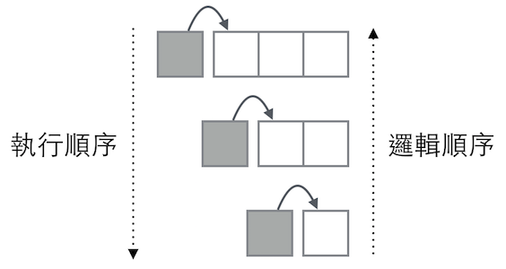
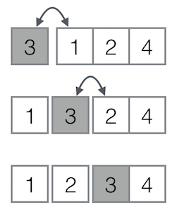

# Insertion sort

## Reference
- [Insertion sort](https://en.wikipedia.org/wiki/Insertion_sort)
- [插入排序Insertion sort](https://zh.wikipedia.org/wiki/%E6%8F%92%E5%85%A5%E6%8E%92%E5%BA%8F)

## 算法描述
1. 從第一個元素開始，該元素可以認為已經被排序
2. 取出下一個元素，在已經排序的元素序列中從後向前掃描
3. 如果該元素（已排序）大於新元素，將該元素移到下一位置
4. 重複步驟3，直到找到已排序的元素小於或者等於新元素的位置
5. 將新元素插入到該位置後
6. 重複步驟2~5

## 算法修改
Scala `List` 執行 `last()` 與 `append()` 代價遠大於 `head()` 與 `prepend()`，上述算法修改成:

1. 從最後一個元素開始，該元素可以認為已經被排序
2. 取出上一個元素，在已經排序的元素序列中由前往後掃描
3. 如果該元素（已排序）小於新元素，將該元素插入剩餘的元素序列（已排序）
4. 重複步驟3，直到找到已排序的元素大於或者等於新元素的位置
5. 重複步驟2~4

```scala
def isort(xs: List[Int]): List[Int] = xs match {
  case Nil     => Nil
  case y :: ys => insert(y, isort(ys))
}                                               //> isort: (xs: List[Int])List[Int]
def insert(x: Int, xs: List[Int]): List[Int] = xs match {
  case Nil     => List(x)
  case y :: ys => if (x < y) x :: insert(y, ys) else y :: insert(x, ys)
}                                               //> insert: (x: Int, xs: List[Int])List[Int]

val list = List(2, 4, 6, 8, 10, 9, 7, 5, 3, 1)  //> list  : List[Int] = List(2, 4, 6, 8, 10, 9, 7, 5, 3, 1)
isort(list)                                     //> res0: List[Int] = List(1, 2, 3, 4, 5, 6, 7, 8, 9, 10)
```

### `isort(xs)`

 (白色方塊表示已排序)

- 邏輯順序：演算法從 list 最後一個元素開始處理，取前一個元素插入已排序好的序列。
- 執行順序：取第一個元素，插入後面(即將執行排序的)序列。然後對(即將執行排序的)序列做相同的動作，不斷迭代直到(即將執行排序的)序列為空序列(`Nil`)。

### `insert(x, xs)`



將`xs`拆成第一個元素(`y = xs.head`)與其他序列(`yx = xs.tail`)，比對`x`與`y`，如果`x < y`，則把`x`放到`xs`之前，否則交換`x`與`y`，把`x`插入`ys`。然後繼續迭代直到(將被插入元素的)序列為空序列(`Nil`)。
